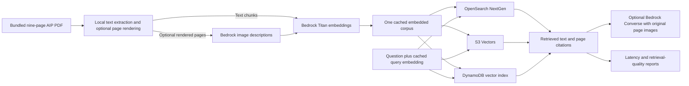

# AWS vector store comparison lab

A command-line AWS CDK project for testing and benchmarking **OpenSearch Serverless NextGen**, **S3 Vectors**, and **native DynamoDB vector search**. Default region: **eu-west-1 (Ireland)**.

The three stores receive the **same float32 embeddings, chunks, document IDs, metadata and cosine metric**. The benchmark measures retrieval independently of model inference, with an exact local baseline. It produces actual measurements when you run it against your account; no cloud benchmark numbers are bundled.

Use the lab to compare retrieval latency, recall, metadata filtering, write visibility, and first-request behavior after idle. The supplied aviation PDF supports both text queries and queries about charts and tables. See the [store comparison](docs/comparison.md), [benchmark methodology](docs/benchmarking.md), and [cost controls](docs/costs.md) for interpretation.

The CLI writes to and queries each vector store directly. **There is no Bedrock Knowledge Base integration.** The current workflow uses Bedrock Titan for corpus and query embeddings, reusing cached embeddings where available. Bedrock image descriptions and answers generated from retrieved evidence are optional. Query embeddings are prepared before benchmark timing starts; the benchmark does not generate answers.

## What is deployed

| Store                         | CLI name     | Lab configuration                                                                                             |
| ----------------------------- | ------------ | ------------------------------------------------------------------------------------------------------------- |
| OpenSearch Serverless NextGen | `opensearch` | One vector collection in a **NEXTGEN** group; minimum indexing/search capacity **0**, maximum **2 OCUs each** |
| S3 Vectors                    | `s3`         | One vector bucket and a 1,024-dimensional cosine index                                                        |
| DynamoDB vector search        | `dynamodb`   | **PAY_PER_REQUEST** table; `lab init` creates its native vector index and waits for readiness                 |

OpenSearch scales down after 10 minutes without requests to any collection in the group. The CLI refuses Classic endpoints. DynamoDB queries use the native vector search API.

Supporting resources are a private S3 bucket for rendered page images and an operator role trusted by an IAM user/role you provide. Runtime permissions are scoped to lab resources and the default Bedrock models.

No frontend, API Gateway, Cognito, deployment pipeline, VPC, NAT gateway, provisioned inference, ingestion service, or polling infrastructure. CDK creates a small on-demand cleanup Lambda for the S3 bucket. **Idle compute can be zero; storage is still billed.** Read [cost controls](docs/costs.md) before running large experiments.



## Prerequisites

- Node.js **24+** (`.nvmrc`), npm, AWS CLI v2.
- Poppler: `brew install poppler` on macOS, or `sudo apt-get install poppler-utils` on Debian/Ubuntu.
- Your AWS credentials supplied in your own terminal through your usual profile/SSO workflow. Never place credentials in this repository.
- Permissions to deploy CDK/CloudFormation, create the listed resources, pass roles, and assume the generated operator role. Bedrock access to Titan Text Embeddings V2 for embeddings, plus the **EU Nova Lite** inference profile for optional image descriptions and answers. When using that profile, organization SCPs must allow its EU destination regions.

Package versions are pinned in `package-lock.json`. Type checking uses TypeScript 7.0.2 through the `@typescript/native` npm alias. The `typescript` alias supplies Microsoft's `@typescript/typescript6` compatibility API for ESLint, following the [official side-by-side setup](https://devblogs.microsoft.com/typescript/announcing-typescript-7-0/). `npm run build` invokes TypeScript 7's `tsc`; the compatibility package exposes `tsc6` separately. Use `npm ci` for reproducible installs. Run `npm outdated` when deliberately refreshing dependencies.

## Local preparation (no AWS calls)

The repository includes [`data/uk-aip-heathrow-demo.pdf`](data/uk-aip-heathrow-demo.pdf), a **nine-page, 2.3 MB** extract from the UK AIP dated **3 September 2026**. It covers measurement conventions, altimeter procedures, Heathrow runway tables, and two airport charts. The full original AIP is not needed. See [source provenance and page mapping](data/README.md) for the original AIP references.

```bash
npm ci
npm run check
npm run lab -- inspect
npm run lab -- inspect --find 'EGLL AD 2.12'
npm run lab -- prepare --images
npm run lab -- plan
```

`inspect` and `prepare` use the bundled PDF by default. `prepare` processes **every page** and writes `.vector-lab/corpus.json` and optional JPEG page renders. Citations and example question labels use physical one-based pages **1–9 of the bundled PDF**, not the original AIP's PDF page numbers or printed section numbers. Text extraction is cached by the PDF's SHA-256 hash.

For a text-only experiment, omit `--images` during preparation and `--vision` during embedding. The walkthrough includes both so the same corpus supports the text and image question sets.

To use another document, pass `--pdf path/to/document.pdf`; preparation processes that entire PDF. Supply matching question labels for benchmarks. The default embedding guard permits 300 source text chunks and 20 vision pages; larger documents may require explicit increases to `--max-chunks` and `--max-image-pages` when embedding. Captions add embedding calls. Local preparation never invokes Bedrock.

If you already prepared the original AIP, rerun `prepare`, `embed`, and `ingest` to use the bundled document and its new page numbers. The document hash gives this corpus a distinct identity, so old corpus records are excluded from its queries.

## Deploy and initialize

This is a **new stack named `VectorLab`**. If you previously deployed the original template's stacks, this change does not delete them. Review and retire those separately; otherwise their costs can continue.

Set your profile and an **IAM role/user ARN**, not an `arn:aws:sts::...:assumed-role/...` session ARN. For SSO, use the actual IAM role ARN including its path. The deployer and runtime operator may be different identities.

```bash
export AWS_PROFILE=your-profile
export AWS_REGION=eu-west-1
export OPERATOR_ARN=arn:aws:iam::123456789012:role/YourRole

# Once per account/region if CDK is not bootstrapped:
npm run cdk -- bootstrap aws://123456789012/eu-west-1

npm run diff -- --parameters OperatorArn="$OPERATOR_ARN"
npm run deploy -- --parameters OperatorArn="$OPERATOR_ARN"

npm run lab -- doctor
npm run lab -- init
```

CDK saves `.vector-lab/outputs.json`; every cloud CLI command reads it and assumes the operator role using your credential provider chain. `doctor` checks identity, explicit NextGen zero floors, and model listings without querying a vector index. Listing a model does **not** prove model invocation access.

New OpenSearch policies can take time to propagate. If `init` receives a 403 immediately after deployment, wait 30–60 seconds and retry; persistent 403s need IAM/data policy inspection. `init` is idempotent and validates existing dimensions/metric. It uses the documented DynamoDB `UpdateTable.VectorIndexUpdates` API because CloudFormation's Table schema currently does not expose vector indexes. Deleting the table removes its vector index.

`--config path/to/config.json` can supply another CDK outputs file or a direct LabConfig object. Keep each deployment's output file and checkpoints separate. The embedding model and dimensions are intentionally fixed; changing them requires code/configuration updates, new indexes, and a newly embedded corpus. The answer/vision model is configurable through `chatModel`, subject to the operator role's model permissions.

## Embed, ingest, and verify

```bash
# Paid on-demand calls; repeated runs reuse content-addressed caches.
npm run lab -- embed --vision
npm run lab -- ingest
npm run lab -- verify
```

Text uses `amazon.titan-embed-text-v2:0` at 1,024 dimensions. `--vision` uses `eu.amazon.nova-lite-v1:0` to describe rendered pages, then embeds those descriptions using the **same text embedding model**. This is **caption-based image retrieval**, not native image embeddings. With `query --answer --images`, the answer model also receives up to four original retrieved page images, so it can inspect diagrams and tables directly.

All three backends store chunk text and provenance. `init`, `ingest`, `verify`, `query`, and `benchmark` target **all three stores by default**; use `--stores opensearch`, `--stores s3,dynamodb`, or `--stores all` to choose. This selects CLI operations; deployment still provisions all three stores.

Rendered page JPEGs are uploaded to ordinary S3; the PDF remains local. Ingestion checkpoints advance **after** each successful batch; rerunning resumes interrupted work. `--force` replays idempotent writes, useful after manually deleting/recreating indexes. Bedrock caches are reusable independently of remote ingestion checkpoints.

`verify` waits for ten representative vectors to become searchable; `--probes N` expands coverage up to all records. Equivalent duplicate vectors count as visible. This is a readiness probe, not a proof of full index population. OpenSearch has a documented 10-second refresh interval; vector search may lag writes. Wait for visibility before interpreting recall.

## Compare retrieved results

```bash
# Retrieve the same question from all three stores, without answer generation:
npm run lab -- query \
  --question 'What dimensions and surface are published for Heathrow runway 09L/27R?' \
  --modality text

npm run lab -- query \
  --question 'Where is Terminal 4 relative to the southern runway on the Heathrow aerodrome chart?' \
  --modality image

# Target one store or apply an identical page filter:
npm run lab -- query --stores dynamodb --page 6 \
  --question 'What landing distance is listed for runway 09L?'
```

Results are printed as JSON and saved to `.vector-lab/query.json`. They include source text, physical PDF page citations, raw backend scores with their direction, and separate embedding/retrieval timings. Raw scores are **not calibrated across stores**. Query embeddings may be cached.

The page labels and notes in [text questions](examples/questions-text.json) and [image questions](examples/questions-images.json) refer to the bundled nine-page PDF. They are small, manually inspected retrieval examples, not an exhaustive relevance dataset or automatic answer-quality grading.

To demonstrate an answer built from a store's retrieved evidence, add `--answer`. Add `--images` as well to send original retrieved page images to the answer model:

```bash
npm run lab -- query --stores s3 \
  --question 'Where is Terminal 4 relative to the southern runway on the Heathrow aerodrome chart?' \
  --modality image --answer --images
```

Answer generation adds model calls and records generation timing and token usage separately. Answers are constrained to retrieved evidence and should admit insufficient evidence. These AIP examples are demonstrations; generated answers are not suitable for flight planning.

## Benchmark

```bash
npm run lab -- benchmark --rounds 10
npm run lab -- benchmark --questions examples/questions-images.json --rounds 10
npm run lab -- benchmark --concurrency 4 --rounds 20

# A separate first-request-after-idle experiment; leave all other clients idle:
npm run lab -- benchmark --idle-seconds 660 --rounds 3
npm run lab -- metrics --minutes 30
```

Each run writes `samples.jsonl`, `report.json`, `summary.csv` and `report.md` under a new `.vector-lab/reports/<timestamp>/` directory. An explicit `--output` directory is overwritten, so use a new path when retaining runs.

Reports include p50/p95/p99 successful-request latency, errors, tie-aware recall@k against exact cosine search, labelled-page hit rate, mean reciprocal rank, and first-request timings. Store order rotates across measured rounds. You can choose `--stores s3,dynamodb` or another subset. Failing samples remain in the report, and the command exits nonzero if any request failed. Latency includes network/SDK retries; model generation is outside retrieval benchmarks. See [methodology](docs/benchmarking.md) for fair interpretation and larger experiments.

An elapsed idle wait **does not prove a cold start**. CloudWatch OCU metrics are the evidence; missing datapoints are never treated as zero. `metrics` uses control-plane APIs and does not wake the collection. Queries, `verify`, and OpenSearch index checks do wake it. No scheduled health checks are deployed.

## Costs and cleanup

```bash
npm run lab -- usage
npm run lab -- metrics
npm run destroy
```

`usage` totals locally recorded actual Bedrock token use, not an AWS bill. Storage, vector requests, and OpenSearch active OCU time (including idle timeout) are additional. [Cost controls](docs/costs.md) explains the billing dimensions and limitations.

Destroy deletes demo tables, vector indexes/collections, and S3 objects. Do not use this stack for irreplaceable data. The source PDF and local caches/reports remain on your machine. CDK bootstrap resources are account-level and are not removed by this stack. Do not leave manually created extra indexes in the lab's vector bucket: they can block bucket deletion.

## Development and validation

```bash
npm run build
npm run lint
npm test
npm run synth
npm run format:check
```

Tests cover cost/security infrastructure invariants, vector API contracts, filter equivalence, batching/retries, PDF chunking, and metric correctness. They use mocked AWS clients and do not require credentials. Successful synthesis is not proof of deployment, regional entitlement, IAM propagation, account quotas, or model runtime access. Live results require the deployment/ingestion commands above.
